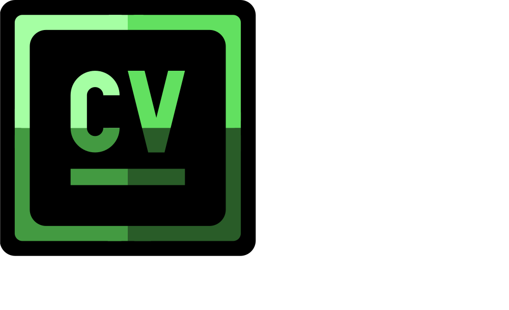

<div align='center'>

<a href='https://cv-hub-jet.vercel.app/'></a>
</div>

access: [cvhub.com](https://cv-hub-jet.vercel.app/)

# 📑 About

O **CVHub** é uma aplicação web interativa que transforma perfis do GitHub em currículos visuais profissionais em PDF, prontos para download. Ele não apenas exibe as informações do usuário, mas também preserva a estética do perfil, incluindo avatar, biografia, estatísticas de seguidores, repositórios mais relevantes e até o conteúdo completo do README, com gráficos e imagens renderizadas.  

O objetivo do CVHub é **facilitar a criação de portfólios profissionais** a partir de dados públicos do GitHub, mantendo um visual limpo e personalizável, adequado para recrutadores, apresentações e networking.

# 🧑‍💻 Features

- Exibição completa do perfil do usuário do GitHub:
  - Avatar, nome, biografia e estatísticas (seguidores, seguindo, repositórios).
- Listagem dos **Top Repositórios** com links diretos para o GitHub.
- Renderização completa do **README** com Markdown e HTML, preservando:
  - Tabelas, gráficos, imagens e links.
- Exportação do currículo completo em **PDF** mantendo o layout, cores e gráficos.
- Suporte a **temas claro e escuro**, respeitando as preferências do usuário.
- Links clicáveis dentro do PDF (em próximos updates podem ser totalmente interativos).


# ⚒️ Technologies Used

- **React.js** – Interface dinâmica e reativa.
- **html2canvas** – Captura o conteúdo da página como imagem para PDF.
- **jsPDF** – Geração de PDF a partir da imagem capturada.
- **ReactMarkdown + remark-gfm + rehype-raw + rehype-sanitize** – Renderização segura e completa do Markdown do README.
- **CSS** – Estilização responsiva e tema escuro/claro.
- **GitHub API** – Obtenção de informações públicas do perfil e repositórios.

# ⚙️ How It Works

1. O usuário insere o login de um perfil GitHub.
2. O CVHub consome a API do GitHub para obter:
   - Avatar
   - Nome e bio
   - Estatísticas (seguidores, seguindo, repositórios públicos)
   - Repositórios do usuário
   - Conteúdo do README
3. O perfil é renderizado em uma interface elegante e responsiva.
4. Ao clicar em **“Baixar CV”**, o conteúdo é capturado via `html2canvas` e transformado em um PDF usando `jsPDF`, preservando gráficos, cores e layout.
5. O PDF resultante está pronto para compartilhamento ou impressão.


# 📋 Upcoming Features

- Links totalmente clicáveis dentro do PDF.
- Personalização de cores, fontes e layout do currículo.
- Suporte a múltiplos perfis e exportação em massa.
- Integração com plataformas de portfólio online.


# 👥 Contribution

Contribuições são bem-vindas!  

1. Faça um **fork** do projeto.  
2. Crie uma branch: `git checkout -b feature/nova-funcionalidade`  
3. Commit suas alterações: `git commit -m "Adiciona nova funcionalidade"`  
4. Faça push para a branch: `git push origin feature/nova-funcionalidade`  
5. Abra um **Pull Request** explicando a alteração.


# 📜 License

Este projeto está licenciado sob a **Licença Apache 2.0** – consulte o arquivo [LICENSE](LICENSE) para detalhes.

<div align='center'>

```🚧⚠️Projeto em desenvolvimento.🚧```
</div>
